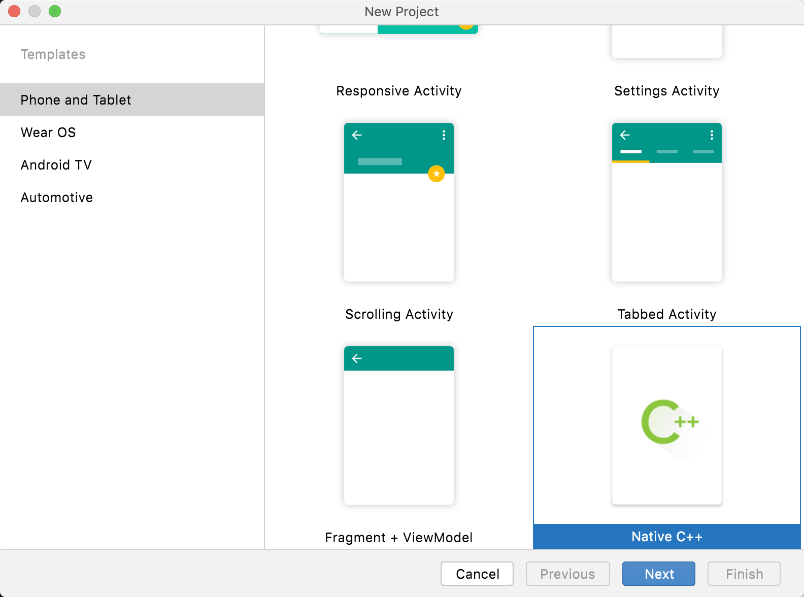

# Load C/C++ Library in Android Project

# Way to Load C/C++ Library

The Android Project can load C/C++ library built by NDK. The library can be:

+ Pure C/C++ code
+ Pure shared library
+ Part C/C++ code, part shared library

## Pure C/C++ code

Just create a **Native C++** project to learn how to use C/C++ code in android program.




## Pure Shared Library

You can create a **Empty Activity** project and add shared libraries (.so files) into the project.

Manually create a `jniLibs` folder in the project `/app/src/main`directory, then put the libraries into it. In this demo, the library files are `libfirst.so` and `libsecond.so`.

```sh
% tree app/src/main/jniLibs
app/src/main/jniLibs
├── arm64-v8a
│   ├── libfirst.so
│   └── libsecond.so
├── armeabi-v7a
│   ├── libfirst.so
│   └── libsecond.so
├── x86
│   ├── libfirst.so
│   └── libsecond.so
└── x86_64
    ├── libfirst.so
    └── libsecond.so

4 directories, 8 files
```

Then create the java interface.

```java
package com.xmac.jni;

/**
 * Example of calling 3rd-party library built by NDK.
 * The "first" library is built by NDK.
 * The "second" library is built by NDK, and it depends on the "first" library.
 */
public class MyNative {
    static {
        System.loadLibrary("first");
        System.loadLibrary("second");
    }
    // Call native function from a library (libfirst.so), which depends another library (libsecond.so)
    // https://developer.android.com/ndk/guides/prebuilts
    public static native int callAdd(int a, int b);
    public static native byte[] callBuf(byte[] buf);
}
```

That's all.

You may see that there are 2 libraries, and one library depends the other one. This is a very common usage scenario. Please go on to learn how to implement this.

## Part C/C++ code, Part Shared Library

You can call a 3rd-party shared library (the .so file)  in the C/C++ native project.

Put the shared library (.so file and the .h file)  into the cpp folder. in this demo, the library file is `libthird.so`.

```sh
% tree app/src/main/cpp 
app/src/main/cpp
├── CMakeLists.txt
├── libs
│   ├── arm64-v8a
│   │   └── libthird.so
│   └── armeabi-v7a
│       └── libthird.so
├── native-lib.cpp
└── third.h

3 directories, 5 files
```

Then modify the `CMakeLists.txt` file to call the library. 

```tex
# For more information about using CMake with Android Studio, read the
# documentation: https://d.android.com/studio/projects/add-native-code.html

# Sets the minimum version of CMake required to build the native library.

cmake_minimum_required(VERSION 3.18.1)

# Declares and names the project.

project("jnidemo")

# Creates and names a library, sets it as either STATIC
# or SHARED, and provides the relative paths to its source code.
# You can define multiple libraries, and CMake builds them for you.
# Gradle automatically packages shared libraries with your APK.

add_library( # Sets the name of the library.
        jnidemo

        # Sets the library as a shared library.
        SHARED

        # Provides a relative path to your source file(s).
        native-lib.cpp)

add_library(third SHARED IMPORTED)
set_target_properties(third PROPERTIES IMPORTED_LOCATION ${CMAKE_SOURCE_DIR}/libs/${CMAKE_ANDROID_ARCH_ABI}/libthird.so )

# Searches for a specified prebuilt library and stores the path as a
# variable. Because CMake includes system libraries in the search path by
# default, you only need to specify the name of the public NDK library
# you want to add. CMake verifies that the library exists before
# completing its build.

find_library( # Sets the name of the path variable.
        log-lib

        # Specifies the name of the NDK library that
        # you want CMake to locate.
        log)

# Specifies libraries CMake should link to your target library. You
# can link multiple libraries, such as libraries you define in this
# build script, prebuilt third-party libraries, or system libraries.

target_link_libraries( # Specifies the target library.
        jnidemo
        third

        # Links the target library to the log library
        # included in the NDK.
        ${log-lib})
```

Then we can call the library function in the .cpp file.

```cpp
#include <jni.h>
#include <string>
#include "third.h"

extern "C" JNIEXPORT jstring JNICALL
Java_com_xmac_jni_CodeNative_stringFromJNI(JNIEnv* env, jclass clazz) {
    std::string hello = "Hello from C++";
    return env->NewStringUTF(hello.c_str());
}

extern "C" JNIEXPORT jint JNICALL
Java_com_xmac_jni_CodeNative_callAdd(JNIEnv *env, jclass clazz, jint a, jint b) {
    int _a = a;
    int _b = b;
    int _c = CallAdd(_a, _b); //function of 'libthird.so'
    return (jint) _c;
}

extern "C" JNIEXPORT jbyteArray
Java_com_xmac_jni_CodeNative_callBuf(JNIEnv *env, jobject clazz, jbyteArray src) {
    // get input buffer and its length
    jbyte *srcbuf = env->GetByteArrayElements(src, 0);
    jsize len = env->GetArrayLength(src);

    // call 3rd-party function
    unsigned char *_srcbuf = (unsigned char*)srcbuf;
    unsigned char *_dstbuf = (unsigned char*)malloc(len);
    CallBuf(_srcbuf, len, _dstbuf); // function of 'libthird.so'

    // change to java type
    jbyte *dstBuf = (jbyte *)_dstbuf;
    jbyteArray jarray = env->NewByteArray(len);
    env->SetByteArrayRegion(jarray, 0, len, dstBuf);

    // release memory
    env->ReleaseByteArrayElements(src, srcbuf, 0);
    free(_dstbuf);

    return jarray;
}s
```


# Built Library by NDK

In the above demo, there are 3 libraries:

+ libfirst.so
+ libsecond.so: which depends librist.so and  provides java interface.
+ libthird.so: which poverid java interface

Let's learn how to build them.

Create a `jni` folder and place the source file into this folder. Then create the `Andorid.mk` and `Application.mk` file.

```sh
libsrc % tree
.
├── build.bat
├── build.sh
├── first
│   └── jni
│       ├── Android.mk
│       ├── Application.mk
│       ├── first.cpp
│       └── first.h
├── second
│   └── jni
│       ├── Android.mk
│       ├── Application.mk
│       └── second.cpp
└── third
    └── jni
        ├── Android.mk
        ├── Application.mk
        ├── third.cpp
        └── third.h

6 directories, 13 files
```

For example, the `Anroid.mk` file for the first library.

```makefile
LOCAL_PATH := $(call my-dir)

include $(CLEAR_VARS)
LOCAL_CFLAGS += -D_XOPEN_SOURCE -D_GNU_SOURCE -DANDROID_GADGET=0 -DANDROID_SMP=0 -D_POSIX_VDISABLE=0
LOCAL_CFLAGS += -DHAVE_FORKEXEC -DHAVE_TERMIO_H
LOCAL_CFLAGS += -I.
LOCAL_LDLIBS+= -L$(SYSROOT)/usr/lib -llog

LOCAL_MODULE    := first
LOCAL_SRC_FILES := first.cpp

include $(BUILD_SHARED_LIBRARY)
```

The `Android.mk` file for the second library. This library calls the function of the first library.

```makefile
LOCAL_PATH := $(call my-dir)

include $(CLEAR_VARS)
LOCAL_CFLAGS += -D_XOPEN_SOURCE -D_GNU_SOURCE -DANDROID_GADGET=0 -DANDROID_SMP=0 -D_POSIX_VDISABLE=0
LOCAL_CFLAGS += -DHAVE_FORKEXEC -DHAVE_TERMIO_H
LOCAL_CFLAGS += -I.
LOCAL_LDLIBS+= -L$(SYSROOT)/usr/lib -llog

LOCAL_MODULE    := first
LOCAL_SRC_FILES := first.cpp

include $(BUILD_SHARED_LIBRARY)
xmac@xhost libsrc % cat second/jni/Android.mk 
LOCAL_PATH := $(call my-dir)

include $(CLEAR_VARS)
LOCAL_MODULE := first
LOCAL_SRC_FILES := libs/$(TARGET_ARCH_ABI)/libfirst.so
include $(PREBUILT_SHARED_LIBRARY)

include $(CLEAR_VARS)
LOCAL_CFLAGS += -D_XOPEN_SOURCE -D_GNU_SOURCE -DANDROID_GADGET=0 -DANDROID_SMP=0 -D_POSIX_VDISABLE=0
LOCAL_CFLAGS += -DHAVE_FORKEXEC -DHAVE_TERMIO_H
LOCAL_CFLAGS += -I.
LOCAL_LDLIBS+= -L$(SYSROOT)/usr/lib -llog

LOCAL_MODULE    := second
LOCAL_SRC_FILES := second.cpp
LOCAL_SHARED_LIBRARIES := first

include $(BUILD_SHARED_LIBRARY)
xmac@xhost libsrc % 

```

Then we can build the source files with `ndk-build` command.

```shell
NDK_PATH=${HOME}/Library/Android/sdk/ndk/21.4.7075529
${NDK_PATH}/ndk-build -C first/jni
```

The building target is in the libs folder.

```sh
 % tree first/libs 
first/libs
├── arm64-v8a
│   └── libfirst.so
├── armeabi-v7a
│   └── libfirst.so
├── x86
│   └── libfirst.so
└── x86_64
    └── libfirst.so
```

